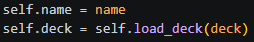
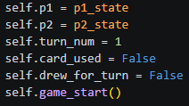
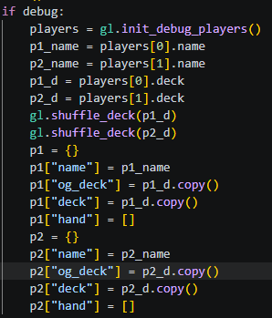

# **Trading Card Game Engine (in Python)**
  
Everything needed in the backend for a Trading Card Game (TCG) written in Python. The TCG Engine requires 2 Players with their usernames and decks. Create a game state using this information and the game will start from there. TCG Engine stores cards in JSON files and loads cards as necessary. TCG Engine is written to be flexible so you can add/change aspects of the game with your TCG's specific needs.  
  
## Requirements:
  
- Python 3.12.3  
  
## Requirements to start the game:
  
- 2 Players:
  * Name  
  * Deck  
  
# **Code Documentation**  
  
## Universal Terms/Info  
Commonly used variable names/extra information about the documentation  
  
#### State  
The state of a player in that moment in time. States will be a dictionary that contains keys: name, og_deck, deck, hand  
name: String  
og_deck:  List of Card objects (cards.py)  
deck: List of Card objects (cards.py)
hand: List of Card objects (cards.py)
  
#### Deck vs OG Deck vs Hand  
`deck` is a copy of the player's deck at the start of the game that is mutable while `og_deck` is also a copy of the player's deck at the start of the game but shouldn't be changed as it's used to compare to the actively played deck to find which cards were used. `hand` is cards the Player currently has available for them to use.  
  
#### Chain
Refers to a list of card objects in the order they were played. Chain will resolve backwards from last card played to first card. Example: Chain[1, 2, 3] will resolve [3, 2, 1].
  
#### (.py)  
When something in the documentation is followed by (.py) `for example: (cards.py)` this means relevant information about the topic can be found in that section of the documentation.  
  
## Player.py  
  
### class Player(name, deck)  
Creates a player based on a player's name and a deck. Deck is a list of strings containing names of cards you have saved in your cards folder.  
  
  
#### Player.load_deck(self, deck)  
Automatically called when the Player object is created. load_deck will take your list of card names and turn them into card objects. (cards.py) Do note: If a card name in deck has a typo or doesn't exist in your cards folder, load_deck will add a None in that card's place.  
  
## Gamestate.py  
  
### class GameState(p1_state, p2_state)  
Creates an initial Gamestate to start the match with.  
  
  
#### GameState.game_start(self)  
Called when GameState is created. This just means both players will draw 5 cards to populate their initial hand.  
  
#### GameState.get_turn_state(self)  
Finds which player's turn it is based on GameState's turn_num value.  
  
### show_hand(hand)  
Takes `hand` which is a list of card objects (cards.py) and prints their names.  
  
## Main.py  
Contains the main gameplay loop.  
  
Debug mode will be enabled by default. To disable just set the global `debug` variable to False. Debug mode will call init_debug_players() (gamelogic.py) and create 2 player states based on that.  
After debug creates the players, Gamestate is created as `gs`. To use your own players outside of debug mode, generate your own `p1` and `p2` states to feed to the GameState object. (gamestate.py)  
Commands available inside the main gameplay loop can be found in gl.help() (gamelogic.py)  
  
### show_turn(turn)  
Called at the start of each turn in debug mode. Takes `turn`, which is the player state of whoever's turn it is, and prints player's name, current deck size, current hand size.  
  
### resolve_chain(chain)  
Pops a card object from the chain and the card is sent to `resolve()` (cards.py). After the current card is resolved, the remaining chain is printed and The program will wait 3 seconds for Players to digest the effects of the cards. This process will be looped until chain is empty.  
  
## Gamelogic.py  
  
### class SeekType(StrEnum)  
A String Enum so that a seeking helper function later in gamelogic.py knows where to allow play to search for a card. For the example game with the example cards only Hand, Deck, and Used Pile are needed but new places can easily be added. The StrEnum is written in Screaming Snake Case while the value is written in lowercase with spaces.  
  
### init_debug_players()  
Called by main.py when it's in debug mode. Will generate a hardcoded deck, change out the cards with your own cards for testing, and then create a Player object (player.py). Returns a list of 2 Player objects.  
  
### select_rand_num(range)  
Returns a random number from 0 to range (int) inclusive.  
  
### shuffle_deck(deck)  
Takes a list of card objects `deck` and randomly shuffles it. Returns nothing so use `shuffle_deck()` directly on the Player's state.  
  
### find_used_cards(ps)  
Takes a Player's state `ps` and compares their `hand` + `deck` against `og_deck`. Creates and returns a list of card objects (cards.py) that are in `og_deck` but aren't in `hand/deck`.  
  
### print_used_cards(ps)  
Takes a Player's state `ps` and prints a list of card names of the cards that have been used throughout the game by the Player.  
  
### add_to_hand(card_obj, ps)  
Adds a card object `card_obj` (cards.py) and adds it to the Player's hand in a Player's state `ps`.  
  
### discard_from_hand(ps)  
Prompt the Player to choose a card from their hand in `ps["hand"]`. Validates the inputted card exists and is in hand. Reprompt if validation fails. Once a card is chosen it is removed from the `ps["hand"]`.  
  
### end_game()  
Force stop the game.  
  
### help()  
Prints the list of commands available in the main gameplay loop (main.py) and the secondary loop in `chain()` (later in gamelogic.py).  
  
### draw(ts)  
Pop a card from the deck and add it to hand. `draw()` also returns the Turn State `ts`.  

### play(card, ts)  
Removes the selected card object `card` (cards.py) from the Turn State's hand `ts["hand"]`.  
  
### in_hand(card, ps), in_deck(card,ps)  
Takes a card name `card` and checks the Player State `ps` to see if that card exists in the hand/deck. Returns True/False accordingly.  
  
### in_used_pile(card, used_pile)  
Checks if a card name `card` exists inside a list of card objects (cards.py) that were played by the Player throughout the game. Returns True/False accordingly.  
  
### chain(gs, ts, played_card)  
Takes the GameState `gs` (gamestate.py), State of Player who started the chain `ts`, and the name of the card that started the chain `played_card`. Secondary gameplay loop that continues until one of the Players pass their turn instead of playing a card. Each card played is formatted as `[card_name, player state, opponent state]` and added in order to a list `chain`. Once a player passes, `chain` is returned.  
  
### get_int_input(min=None, max=None)  
Prompts the Player to input a number in an optional inclusive range. Both `min` and `max` are needed to establish a range or the function will act as if there is no range. Returns the inputted number.  
  
### get_card_input(ps, seek_type)  
Prompts the Player to choose a card from a location based on the SeekType StrEnum `seek_type`. Ensures the player chooses a valid card that exists at that location. Returns the name of the card.  
  
# TODO: Document Cards.py